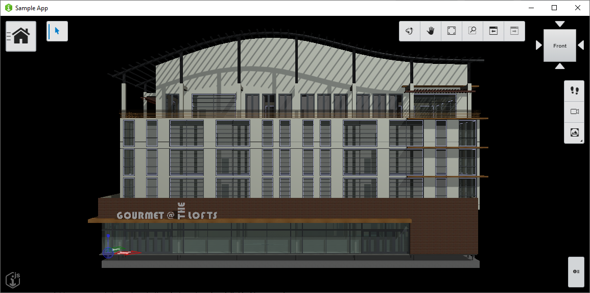

# Desktop Starter

Copyright © Bentley Systems, Incorporated. All rights reserved. See [LICENSE.md](./LICENSE.md) for license terms and full copyright notice.

The purpose of this repository is to serve as starting point for developers wishing to create an iTwin.js Electron app.

See <https://itwinjs.org> for comprehensive documentation on the iTwin.js API and the various constructs used in this app.



## Development setup

1. Install the dependencies:

    ```sh
    npm install
    ```

1. Configure client id
    1. Create a new Desktop/Mobile client at [developer.bentley.com](https://developer.bentley.com/register)
    1. Add the Client ID to the `initialize` method in [./src/backend/main.ts](./src/backend/main.ts#L55)

1. Start the app:

    ```sh
    npm start
    ```

## Advanced configuration options

If an iModel is needed for testing, follow the developer registration procedure [here](https://itwinjs.org/learning/tutorials/create-test-imodel-offline/)

### Client registration

These variables must be updated before deployment, but the supplied defaults can be used for testing on localhost. Create a client registration using the procedure [here](https://itwinjs.org/learning/tutorials/registering-applications/). For the purpose of running this app on localhost, ensure your registration includes <http://localhost:3000/signin-oidc> as a valid redirect URI.

## Contributing

[Contributing to iTwin.js](https://github.com/imodeljs/imodeljs/blob/master/CONTRIBUTING.md)
