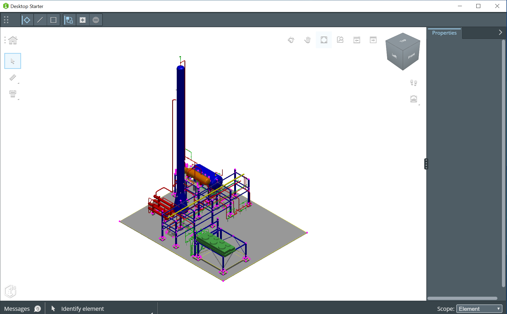

# Desktop Sample App

Copyright © Bentley Systems, Inc.

This iModel.js desktop sample application uses the Bentley 9-Zone UI layout pattern and demonstrates opening an iModel and viewing its data.
For an overview of the 9-Zone UI layout pattern, see [9-Zone UI Pattern](https://imodeljs.github.io/iModelJs-docs-output//learning/ui/ninezone/).

The data is presented using the following components:

- _Viewport_: Renders geometric data onto an HTMLCanvasElement.
- _Property Grid_: Displays properties of selected element(s).

This app serves as a guide on how you can develop your own 9-zone desktop application.
See http://imodeljs.org for comprehensive documentation on the iModel.js API and the various constructs used in this sample.



## Purpose

The purpose of this application is to demonstrate the following:

- [Dependencies](./package.json) required for iModel.js-based frontend applications.
- [Scripts](./package.json) recommended to build and run iModel.js-based applications.
- How to set up a simple [backend](./src/backend/main.ts).
- How to set up a simple [frontend](./src/frontend/app/SampleApp.ts).
- How to implement:
  * Unified selection between a
  [viewport](./src/frontend/components/Viewport.tsx),
  and a [property grid](./src/frontend/components/Properties.tsx)
  * Widget (
  [Property Grid](./src/frontend/app-ui/widgets/PropertyGridWidget.tsx) )
  * Content view ( [Viewport](./src/frontend/components/Viewport.tsx) )
  * [Backstage](./src/frontend/app-ui/backstage/AppBackstageItemProvider.tsx)

For more information about developing a 9-Zone app, see [Learning ui-framework Package](https://imodeljs.github.io/iModelJs-docs-output//learning/ui/framework/).

## Development setup

1. (Optional) Create a sample project using the procedure at [Developer Registration](https://www.imodeljs.org/getting-started/registration-dashboard/?tab=1).  This step is not needed if you already have a project to test with.

2. (Recommended) Register your application at [Developer Registration](https://www.imodeljs.org/getting-started/registration-dashboard/?tab=0).

    Create a *Desktop* app registration with <http://localhost:3000/signin-callback> as a valid redirect URI. The client ID should start with "native-".

    Note: If you are just testing on localhost you can use the default registration included in the sample. However, it's recommended that you complete the registration, especially since registration is a requirement before the application can be deployed. For more information, see the section on [authorization](https://imodeljs.org/learning/common/accesstoken/).

3. Configure your app using the values you obtained from the registration process.  To do so, edit the `.env.local` file.

4. Install the dependencies:

    ```sh
    npm install
    ```

5. Build the app:

    ```sh
    npm run build
    ```

6. Start the app:

      for debugging:

      ```sh
      npm start
      ```

      or just:

      ```sh
      npm run electron
      ```

## Contributing

[Contributing to iModel.js](https://github.com/imodeljs/imodeljs/blob/master/CONTRIBUTING.md)
